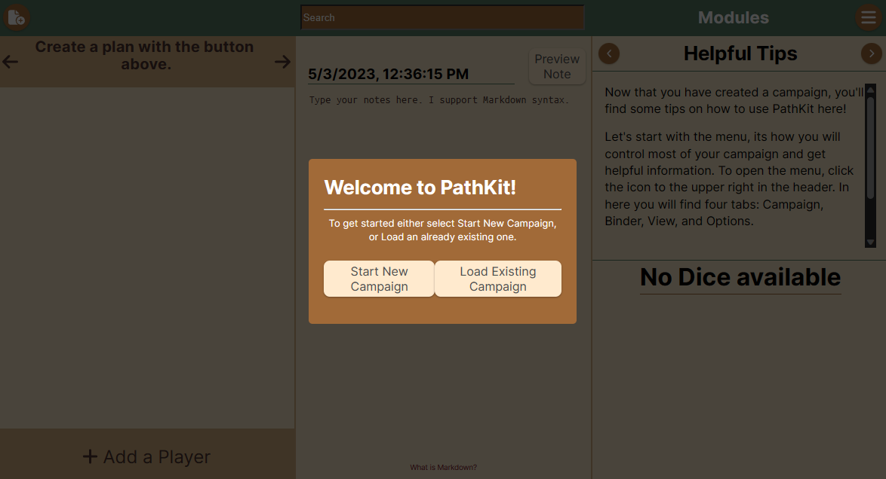

# PathKit - Pathfinder 2e Virtual GM Screen

PathKit is a virtual GM (Game Master) screen for the tabletop role-playing game Pathfinder 2e. It provides a set of tools and features to assist GMs in running their game sessions smoothly and efficiently. This GitHub repository contains the source code for PathKit, and this README serves as a guide to help users understand its features and installation process.

## Project Demo Video
[View an example gameplay usage of prototype](https://www.youtube.com/watch?v=01wgcb1VR4I)

[Use the prototype demo](https://main--fantastic-pegasus-e6a1d9.netlify.app/)

## Alpha Release
[View a demo for the Alpha Release](https://youtu.be/HHFSkAdBkdI)
### Functional use-cases
1. **Click on planned encounters:** You can select an encounter you have planned to run the initiative screen and organize initiative for you.
2. **Add Players, NPCs, Structures, Hazards, and Monsters:** You can create custom entities by using the creation menu in the upper left corner of the header.
3. **Add Planned Encounters or Exploration Paths:** You can create custom plans by using the creation menu in the upper left corner of the header.

## Major Features

PathKit comes with the following major features:

1. **Physics-based Dice Roller:** PathKit includes a physics-based dice roller that provides realistic and immersive rolling experience for GMs and players.
2. **GM Customization Options:** GMs can customize various input options in PathKit, such as modifying dice rolls, adjusting character stats, and setting up encounter modes.
3. **Create Exploration or Encounter Modes:** PathKit allows GMs to create exploration or encounter modes, where they can easily manage player and NPC actions, initiative order, and other game mechanics.
4. **Add Players/NPCs/monsters/Shops:** PathKit provides an easy-to-use interface for GMs to add and manage players, NPCs, monsters, and shops within the game session.
5. **Integrated Search Engine:** PathKit includes an integrated search engine that allows GMs to quickly search for rules, spells, items, and other game-related information.
6. **Notes Feature:** PathKit has a built-in notes feature that enables GMs to take and manage session notes, campaign details, and other important information.

## Stretch Goals

In addition to the major features, PathKit has the following stretch goals:

1. **Apply Damage to Parties Based on Rolls:** PathKit includes a button that allows GMs to apply damage to parties based on rolls, providing a quick and convenient way to resolve combat and other situations.
2. **Take Links from PathBuilder:** PathKit integrates with PathBuilder, a popular character building tool for Pathfinder 2e, allowing GMs to easily import player builds into their game session.
3. **Tablet View:** PathKit is designed to be responsive and compatible with tablet devices, providing a swipeable interface for easy navigation between different portions of the screen.

## Technology Stack

PathKit is built using the MVC (Model-View-Controller) architecture system, with the following technology stack:

- **Model** The responsibilities of Model classes include managing the data and business logic of the application, such as retrieving data from APIs or databases, processing data, and enforcing business rules. We are using SQLite.
- **View** The responsibilities of View components include rendering the user interface using React components, handling user input, managing component state, and updating the UI based on user interactions. We use a a react-ts Vite instance.
- **Controller** The responsibilities of Controller components include handling user input, updating the Model based on user actions, and triggering updates in the View to reflect changes in the data. They act as the glue between the Model and View components, facilitating communication and coordination. Our zustand store does this. 
- **Container** It provides a bridge between the web-based UI components built with React, Vite, and TypeScript, and the native desktop environment, enabling a smooth and seamless user experience. We are using Tauri.

## Installation (Build/Run For Users)

To install and run PathKit locally please look over our helpful Wiki [user guide](https://github.com/LeeJMorel/PathKit/wiki/User-Manual) which we update with each release as needed.

## Contributing (Build/Run/Test For Developers)

Contributions to PathKit are welcome! If you would like to contribute to the development of PathKit, please follow the guidelines outlined in the [developers guide](https://github.com/LeeJMorel/PathKit/wiki/Developer-Guidelines) in the wiki. Included are instructions on how to build, run, and test using our existing tools.

## License

PathKit is released under the [MIT License](LICENSE), which allows for free use, modification, and distribution of the software. Please refer to the LICENSE file for more details.

## Acknowledgements

We want to thank our amazing professor for helping lead us through a complete production process and make our vision a reality! Thank you [Nigini](https://github.com/nigini)! We also want to thank our TA, Apollo, for all the work they put into reviewing our project to make it have more complete communication and well defined project goals.
