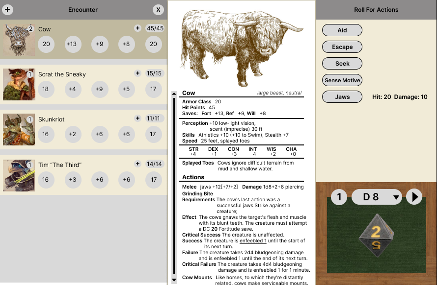

# PathKit - Pathfinder 2e Virtual GM Screen

PathKit is a virtual GM (Game Master) screen for the tabletop role-playing game Pathfinder 2e. It provides a set of tools and features to assist GMs in running their game sessions smoothly and efficiently. This GitHub repository contains the source code for PathKit, and this README serves as a guide to help users understand its features and installation process.

## Major Features

PathKit comes with the following major features:

1. **Physics-based Dice Roller:** PathKit includes a physics-based dice roller that provides realistic and immersive rolling experience for GMs and players.
2. **GM Customization Options:** GMs can customize various input options in PathKit, such as modifying dice rolls, adjusting character stats, and setting up encounter modes.
3. **Create Exploration or Encounter Modes:** PathKit allows GMs to create exploration or encounter modes, where they can easily manage player and NPC actions, initiative order, and other game mechanics.
4. **Add Players/NPCs/Beasts/Shops:** PathKit provides an easy-to-use interface for GMs to add and manage players, NPCs, beasts, and shops within the game session.
5. **Integrated Search Engine:** PathKit includes an integrated search engine that allows GMs to quickly search for rules, spells, items, and other game-related information.
6. **Notes Feature:** PathKit has a built-in notes feature that enables GMs to take and manage session notes, campaign details, and other important information.

## Stretch Goals

In addition to the major features, PathKit has the following stretch goals:

1. **Apply Damage to Parties Based on Rolls:** PathKit includes a button that allows GMs to apply damage to parties based on rolls, providing a quick and convenient way to resolve combat and other situations.
2. **Take Links from PathBuilder:** PathKit integrates with PathBuilder, a popular character building tool for Pathfinder 2e, allowing GMs to easily import player builds into their game session.
3. **Tablet View:** PathKit is designed to be responsive and compatible with tablet devices, providing a swipeable interface for easy navigation between different portions of the screen.

## Technology Stack

PathKit is built using the MVC (Model-View-Controller) architecture system, with the following technology stack:

- **Front-end:** React.js is used for the front-end development of PathKit. React.js was chosen for its familiarity and flexibility to be used across local devices, such as laptops and tablets.
- **Back-end:** Node.js is used for server-side communication with the React.js front-end.
- **Database:** MariaDB, an open-source database system with faster caching compared to MySQL, is used for data storage in PathKit.
- **Containerization:** Docker is used to package the entire application into a container for easy installation and deployment.

## Installation

To install and run PathKit locally, follow these steps:

1. Clone the PathKit repository from GitHub.
2. Install Docker on your local machine, if not already installed.
3. Build the Docker container using the provided Dockerfile.
4. Run the Docker container, which will start the PathKit application.
5. Access the PathKit application from your web browser and start using its features.

Alternatively, a wrapper for a packaged installation may be provided, depending on further research.

## Contributing

Contributions to PathKit are welcome! If you would like to contribute to the development of PathKit, please follow the guidelines outlined in the CONTRIBUTING.md file in the repository.

## License

PathKit is released under the [MIT License](LICENSE), which allows for free use, modification, and distribution of the software. Please refer to the LICENSE file for more details.

## Acknowledgements
