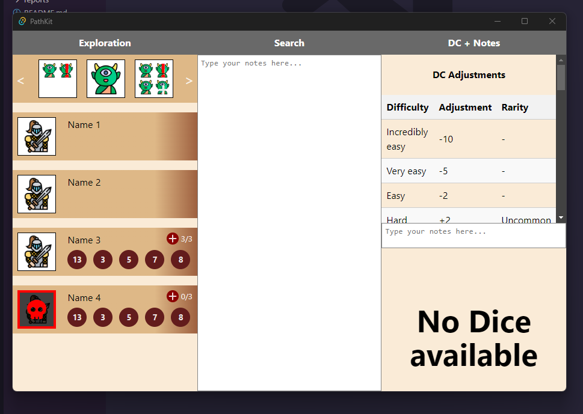

# Weekly Status Report

## Team Report

### Agenda for Project Meeting

- Review progress and issues from the past week
  - hows the scheduale look?
- Discuss individual contributions and updates
  - lots of stuff in lots of directions, will do my best to sum up
- Outline plans and goals for the following week
  - concerns on course spec to be clarified
- Address any concerns or roadblocks

## Contributions of Individual Team Members

### [Individual team members should include the following]

- **Progress**: Briefly describe what you accomplished during the past week.
- **What worked**: Highlight any successes or positive outcomes.
- **What you learned**: Share any new insights or lessons learned.
- **Issues**: Mention any challenges or roadblocks faced.
- **Plans for the following week**: Outline your tasks and goals for the upcoming week, including any unfinished tasks from the previous week and estimated time for completion.

### [Chris Bendix]

- **Progress**: High-level schema is in development in collaboration with Lee, researched and identified viable deployment packager (Tauri) that suits database needs and how our potential DBMA (MariaDB) can integrate with Tauri and our frontend 
- **What worked**: Progress made on schema layout; our deployment package needs were solved quite readily with Tauri as research showed its compatibilty and information on integration between front-end, back-end, and packaging
- **What you learned**: Becoming more familiar with our potential packages and the packaging of deployables; became more familiar with data and its organization needs in Pathfinder 2e
- **Issues**: Relying on Lee for game detail towards data management needs; discussion helped clarify some of our data architecure needs while opening new questions re: customizability of input, etc. More discussion needed
- **Plans for the following week**: Develop the ER Diagram with Lee's input on data management needs and structuring, finalize packages used for data management and retrieval, develop coding guidelines for my back-end components, expand living document

### [Jacob Anderson]

- **Progress**: created testing tasks for the scrum board to keep myself on track, installed testing tools to the repo
- **What worked**: Github interface very intuitive, so it saved me a lot of time in tracking things
- **What you learned**: I have a better understanding of the timeline of the project thanks to going through each week's deliverables
- **Issues**: one question: how should I approach the pull requests? Create local branch and publish then PR?
- **Plans for the following week**: plan testing interface and style guidelines for frontend, backend, dice, etc., figure out CI tools to use

### [Kevin Zhang]

- **Progress**: Created simple UI for dice roller, proposed and researched options to integrate unity standalone project into react front end. Shared protoype of dice roller with team and collected feedbacks.
- **What worked**: Dice roller is somewhat functional now, just need to polish it more and add in some options to change/add dices.
- **What you learned**: I became more familar with the tools that could be used for integrating unity projects onto web enviroment, learned alot about unity webGL.
- **Issues**: Found a bug sometimes the dice does not land properly but on their edge, will work on a fix next week.
- **Plans for the following week**: fix the edge landing bug of the dice roller, further develop the UI for dice roller, help backend to develop coding guidelines and expand the living document on documentations. Start experimenting with Unity webGL for front end integration. 

### [Lee Janzen]

- **Progress**: Created the starting framework for the UI, and nested it inside an executable (Tauri), documentation was updated at multiple points.
- **What worked**: We have a downloadable app! I have not yet released a build (will do that at Alpha)
- **What you learned**: I learned all about tauri, we had to reframe froma  docker package to the executable option.
- **Issues**: Not much, had a couple of codsing issues here and there, to be expected as a junior dev.
- **Plans for the following week**: Next week has some more needed documentation to focus on, including possible coordination with back-end team. Going to build out the ER Diagram with backend to ensure high-level schema exsists, and rubber duck possible UI issues in the process. Hopefully all components are built, so we can start HCI testing to prevent future user error.

### [Luke Evans]

- **Progress**: Got more familiar with Figma, developing color scheme and logos.
- **What worked**: Figma tutorials, learning from friends
- **What you learned**: Shortcuts, tools, websites that are good resources.
- **Issues**: Got sick Monday, need to dedicate more time to learning.
- **Plans for the following week**: Finish color scheme and iconography, design components for PathKit

## Team Report

- **Goals from last week**:
1. Turning in the living doc (Luke)
2. Adjust for feedback from Apollo (Lee)
3. Make template for meeting note issues (Kevin)
4. Create repo (already done)
5. Create top level readme (already done)
6. Create issues (already done)
7. Bookmark repo to slack (already done)
8. Decide architectures (all of us)
9. Create schedule for your role (all of us)
10. Focus heavily on research and planning (all of us)
11. Review git conflict resolution. Linked on scrum board
12. Update wiki as you go
13. Meeting to prototpye early plans for the dice roller
- **Progress and issues**:
1. Created scheules and SCRUM board items for everyone
2. Decided on and installed tools to the repository
3. Working skeleton prototype
- **Plans and goals for the following week**:
1. Develop ER diagram (Chris, Lee)
2. Document packages in living doc (Chris, Jacob)
3. Writing the three new sections in living doc: software architecture, coding guidelines, software design
4. Risk assessment (all)
- **Responsible team members**:

Note: Please update the template with specific details related to your project and team dynamics. Use this template as a starting point for your weekly status reports to keep your team and staff informed about your progress and plan for the upcoming week.
