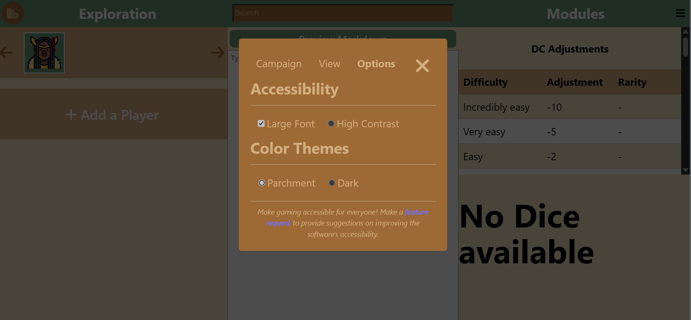

# Weekly Status Report

## Team Report

### Agenda for Project Meeting

- Review progress and issues from the past week
- Discuss individual contributions and updates
- Outline plans and goals for the following week
- Address any concerns or roadblocks

## Contributions of Individual Team Members

### [Individual team members should include the following]

- **Progress**: Briefly describe what you accomplished during the past week.
- **What worked**: Highlight any successes or positive outcomes.
- **What you learned**: Share any new insights or lessons learned.
- **Issues**: Mention any challenges or roadblocks faced.
- **Plans for the following week**: Outline your tasks and goals for the upcoming week, including any unfinished tasks from the previous week and estimated time for completion.

### [Chris Bendix]

- **Progress**:
- **What worked**:
- **What you learned**:
- **Issues**:
- **Plans for the following week**:

### [Jacob Anderson]

- **Progress**:
- **What worked**:
- **What you learned**:
- **Issues**:
- **Plans for the following week**:

### [Kevin Zhang]

- **Progress**:
- **What worked**:
- **What you learned**:
- **Issues**:
- **Plans for the following week**:

### [Lee Janzen]

- **Progress**: Built final front end features including search bar, proper forms, initiative tracker, dragable cards, tips module, and conditions menu. Can now edit, delete, or add all custom objects. Changed a lot based on the HCI feedback as the week went by, so much of the menu flow and icons have changed. Updated to UX feedback from Luke regarding color schemes and components
- **What worked**: Got some great new packages to make draggable items and rendering work for a much better user flow. People really loved the color themes, and we got good feedback on the accesibility features from partially blind users. 
- **What you learned**: Icons needed to be a lot clearer and repeated less. We needed to provide users with more specific walk throughs on many things, and better ways to manage their data.
- **Issues**: Coding at this point has gotten very hard to do. Much of the simple implimentations are done, and I am left with streaching my skills as a full stack developer. Speed has slowed down significatly and I have to spend more time resolving small issues.
- **Plans for the following week**: Integration fully with the backend elements, so our users can store data seamlessly.

### [Luke Evans]

- **Progress**: Designed general layout for sheets (loading the info for entities) based on data we can load, discussed with Lee how different sheets will appear based on the entity, designed tweaks to appearance of initiative cards, designed tweaks to buttons/icons based on user feedback, sent feedback form to my friends who have played Pathfinder 2e.
- **What worked**: Since we already had general design aspects and wanted to focus on layout when making the sheets, writing on paper was effective. 
- **What you learned**: Value of working on Figma vs paper. How fields can be made visible/not visible in React affects coding complexity. HCI feedback gave insight into what new users experience with the app.
- **Issues**: Colors need to be updated. Noticed a couple instances in high contrast themes where there needs to be more contrasting foreground/background.
- **Plans for the following week**: Edit the colors, write a script for demo-ing the prototype, film the demo ASAP, produce video with clips from teammates covering slides.

## Team Report

- **Goals from last week**:
  1. Design all Figma components (Luke)
  2. Install dice roller instance (Kevin)
  3. Install test libraries (Jacob)
  4. Write testing and CI documentation (Jacob)
  5. Define UX components (color themes in by EOD Tuesday) (Luke)
  6. Research contrast color schemes (Luke)
  7. Get HCI feedback on the prototype (Luke/Lee)
  8. Create entity objects and forms with functionality (Lee)
  9. Clean up code and begin adding commentary (Lee)
  10. Install SQLite to project base (Chris)
  11. Create basic tables in SQLite as defined by our diagram (Chris)
  12. Jacob meets with each unit to discuss testing integration in each area (Team)
- **Progress and issues**:
  1. Jacob was able to meet the testing deleverables and we are now fully integrated for testing
  2. Colors and components have been designed and instantiated.
  3. The dice roller instance was not able to be prioritized as hoped, so it has been moved to this week to resolve.
  4. Integrated SQL tables and the app is ready for data integreation.
- **Plans and goals for the following week**:
  1. Write so much tests
  2. Write and record the prototype presentation
  3. Update the ReadMe and wiki with latest information.
  4. Write the controller integration for backend
  5. Integrate the search bar to properly parse a JSON onject
  6. Further refinement of user flow and entity forms
  7. Integrate dice roller instance
- **Responsible team members**:
     Pretty much everyone this week, we all have a lot of challenging tasks ahead to keep pace and are utilizing how our team roles spread out to handle significantly different goals for each part of the application. Front-end and back-end will meet and build the controllers together.

Note: Please update the template with specific details related to your project and team dynamics. Use this template as a starting point for your weekly status reports to keep your team and staff informed about your progress and plan for the upcoming week.
